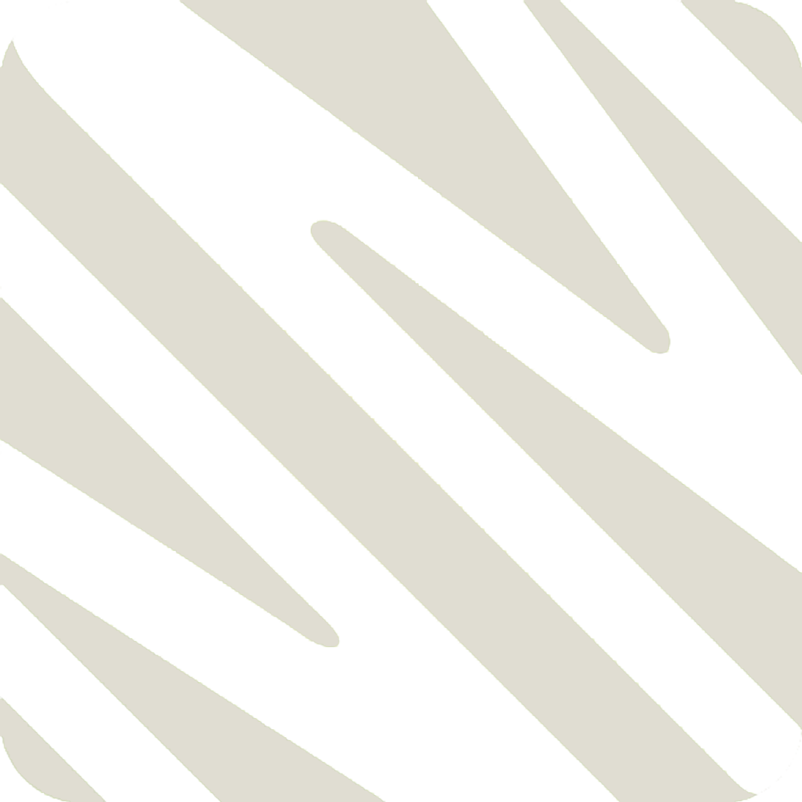

# 🌌 N&Mstudio_SolarSystem — Tinh Đồ Thái Dương 3D

<div align="center">
  
  <h3>Đài Quan Sát Hệ Mặt Trời 3D Tương Tác Thuần WebGL</h3>
  <p>
    <b>Website Trực Tuyến:</b> <a href="https://tinh-do-thai-duong.vercel.app">https://tinh-do-thai-duong.vercel.app</a><br>
    <b>Hotline / Zalo Liên Hệ:</b> <a href="tel:+84985578385">+84 985578385</a>
  </p>
</div>

---

## ✨ Tính năng nổi bật

- **Quỹ đạo thực tế**: Mô phỏng vị trí các hành tinh, vệ tinh và Mặt Trời theo phần tử Kepler J2000 và chuỗi tính toán Mặt Trăng Meeus.
- **Thả người xuống bề mặt (Surface Mode)**: Đứng trực tiếp trên Trái Đất, Mặt Trăng, Sao Hỏa, Sao Thủy, Io, Europa, Ganymede, Titan, Triton để ngắm bầu trời từ góc nhìn người quan sát.
- **Mô phỏng Nhật thực & Nguyệt thực**: Dò chính xác vị trí và thời điểm bóng Mặt Trăng đổ xuống Trái Đất theo thời gian thực tế.
- **Bầu trời tối nay**: Xem lịch mọc/lặn, pha Trăng và danh sách các hành tinh quan sát được từ các thành phố lớn tại Việt Nam (Hà Nội, TP. Hồ Chí Minh, Đà Nẵng, Cần Thơ,...).
- **8 Bài học thiên văn tương tác**: Dành cho học sinh từ lớp 6 đến lớp 10 kèm câu hỏi trắc nghiệm tương tác trực quan.
- **Bản đồ 5.044 sao & chòm sao**: Tích hợp danh mục Hipparcos / Yale BSC và các vật thể Messier.
- **Hiệu năng tự thích ứng (Adaptive Quality)**: Tự động điều chỉnh độ phân giải và chất lượng đồ họa theo FPS để máy yếu hoặc điện thoại vẫn hoạt động mượt mà.
- **Tối ưu đa nền tảng**: Tương thích hoàn toàn với Desktop, iPhone/iPad (Safari với Safe Area Inset) và điện thoại Android.

---

## 🛠️ Công nghệ sử dụng

- **WebGL 2.0 & GLSL ES 3.0**: 22 Shaders tự dựng, không phụ thuộc thư viện 3D bên thứ ba.
- **Dữ liệu bề mặt**: NASA Visible Earth (Blue Marble), NASA LRO/USGS, ESO S. Brunier (Milky Way).
- **Không yêu cầu Backend/Build step**: Chạy trực tiếp từ file tĩnh HTML/CSS/JS.

---

## 🚀 Cài đặt & Chạy cục bộ

Chỉ cần mở trực tiếp file `index.html` trên trình duyệt hỗ trợ WebGL 2 (Chrome, Edge, Firefox, Safari phiên bản mới) hoặc dùng máy chủ HTTP cục bộ:

```bash
# Sử dụng Python
python -m http.server 8000

# Hoặc sử dụng Node.js (npx serve)
npx serve .
```

Sau đó truy cập: `http://localhost:8000`

---

## 📞 Thông Tin Liên Hệ

- **Đơn vị phát triển**: **N&Mstudio**
- **Dự án**: **N&Mstudio_SolarSystem**
- **Hotline / Zalo**: [+84 985578385](tel:+84985578385)
